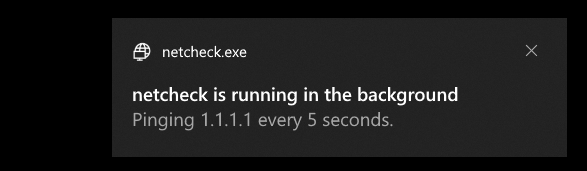

# netcheck
Do you have bad internet? Well this is the right app for you! :D

### __DISCLAIMER: As of now, this app does not have a built-in exit method; a kill.bat file is included in the source and release.__

## Screenshot

## Requirements (for source):
- Python 3.9.5 or higher
- The following Python dependencies (use `pip install x` for these):
  - win10toast
  - pythonping
- Nuitka (for compiling)

## Usage:
### As a script
- Download the source
- If you haven't already, download the Python dependencies (listed above), either manually, or with the `install_dependencies.bat` script
- Run `netcheck.py`. Keep the `bin` and `res` files in the same spot (on the same subdirectory as `netcheck.py`).

### As a standalone app (compiled)
- Download the source
- If you haven't already, download the Python dependencies (listed above), either manually, or with the `install_dependencies.bat` script
- Run `compile.bat` (it won't bite, trust me). Once compiled, you'll find the app inside `netcheck.dist` (again, keep everything inside in the same spot; you can move the whole folder)

## Releases
There are also releases available in, you guessed it, the Releases tab. Inside the zip, you'll find a `netcheck.dist` folder, along with a script to kill the application (again, leave the folder as is).